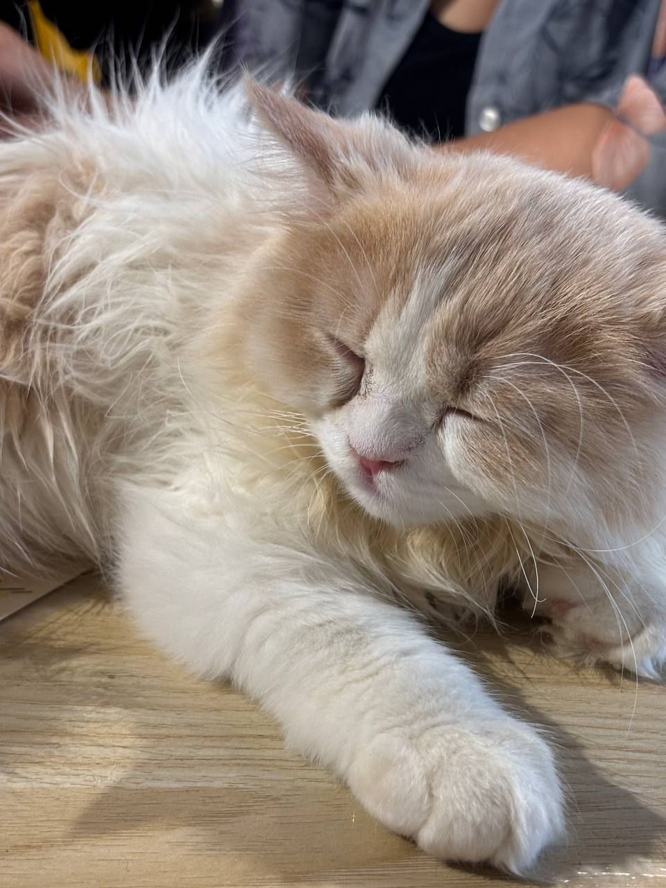
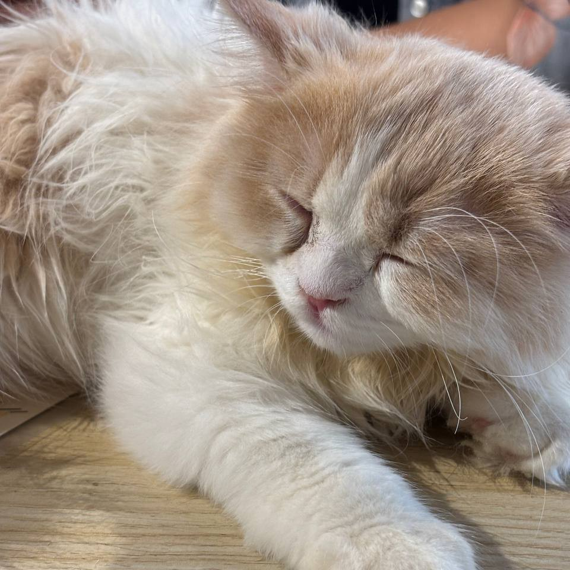
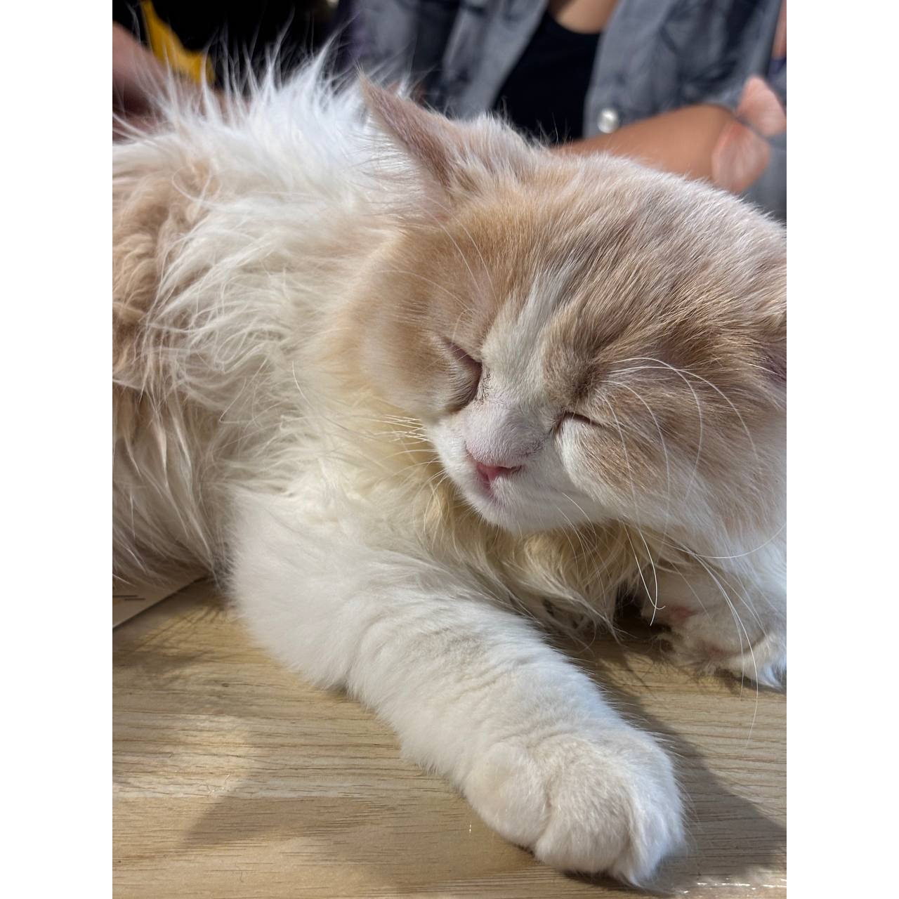
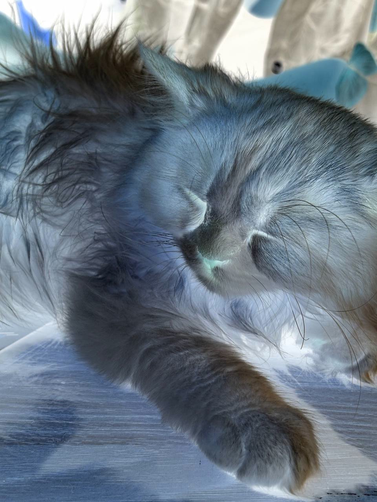
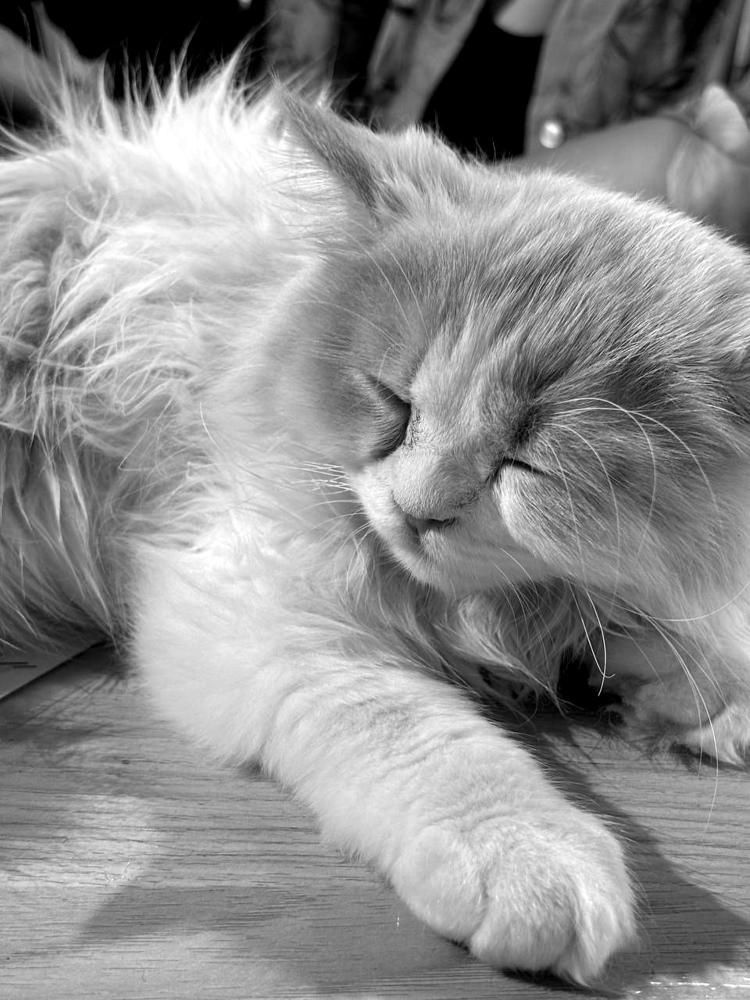
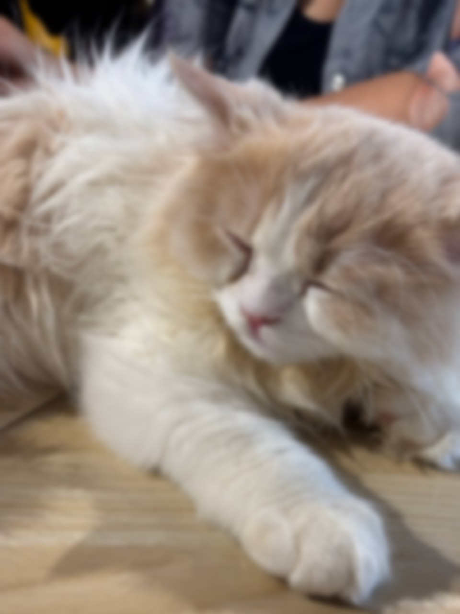

# ImageConverter API

A lightweight Go-based REST API for image processing, built with the Echo framework. Supports image conversion, cropping, fitting to square, color inversion, and applying filters (grayscale, blur).

## Features

- **Convert**: Convert images to JPEG, PNG, or WebP with adjustable quality.
- **Square Crop**: Crop images to a square by trimming edges.
- **Fit to Square**: Place images on a square canvas with padding.
- **Invert**: Invert image colors.
- **Apply Filter**: Apply grayscale or blur filters with customizable intensity.

## Endpoints

| Endpoint          | Description                     | Parameters                              |
|-------------------|---------------------------------|-----------------------------------------|
| `POST /convert`   | Convert image format            | `file`, `output_format` (jpeg/png/webp), `quality` (1-100, default 80) |
| `POST /square-crop` | Crop to square                | `file`                                  |
| `POST /fit-to-square` | Fit to square canvas         | `file`, `output_format`, `quality`       |
| `POST /invert`    | Invert colors                  | `file`                                  |
| `POST /apply-filter` | Apply grayscale/blur filter | `file`, `filter_name` (grayscale/blur), `intensity` (default 10) |

## Example Results

Input image: `image.jpg`

| Operation       | Output Image                              |
|-----------------|-------------------------------------------|
| Convert (JPEG)  |  |
| Square Crop     |  |
| Fit to Square   |  |
| Invert          |  |
| Grayscale       |  |
| Blur            |  |

## Setup

1. **Clone the Repository**:
   ```bash
   git clone <repository-url>
   cd imageConverter
   ```

2. **Install Dependencies**:
   ```bash
   go get github.com/labstack/echo/v4
   go get github.com/disintegration/imaging
   go get golang.org/x/image/webp
   ```

3. **Run the Server**:
   ```bash
   go run main.go
   ```
   The server runs on `http://localhost:8080` by default.

## Usage

Test the endpoints using `curl`. Example with `image.jpg`:

```bash
# Convert to JPEG
curl -X POST http://localhost:8080/convert -F "file=@image.jpg" -F "output_format=jpeg" -F "quality=80" -o converted_image.jpg

# Square Crop
curl -X POST http://localhost:8080/square-crop -F "file=@image.jpg" -o square_cropped_image.jpg

# Fit to Square (PNG)
curl -X POST http://localhost:8080/fit-to-square -F "file=@image.jpg" -F "output_format=png" -F "quality=80" -o square_fitted_image.png

# Invert
curl -X POST http://localhost:8080/invert -F "file=@image.jpg" -o inverted_image.jpg

# Apply Grayscale Filter
curl -X POST http://localhost:8080/apply-filter -F "file=@image.jpg" -F "filter_name=grayscale" -F "intensity=20" -o grayscale_image.jpg
```


## Requirements

- Go 1.16+
- Input images must be valid JPEG, PNG, or WebP files.
- Maximum image size is 10MB (configurable via `MAXIMAGESIZE` environment variable).

## License

MIT License
